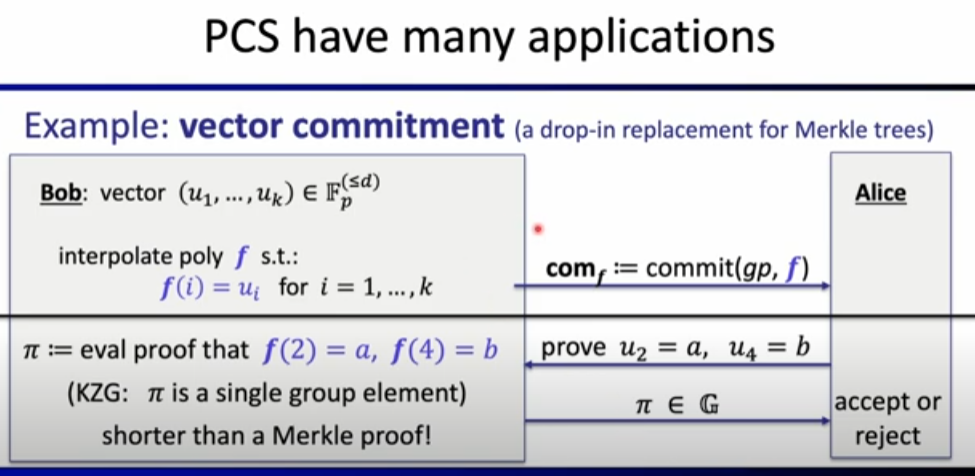

# The PLONK SNARK
Lecturer: Dan Boneh

### Recall: build an efficient SNARK
We take:
- A polynomial commitment scheme
- A polynomial Interactive Oracle Proof (IOP)

Once combined, it gives us the SNARK for general circuits.

#### Review of polynomial commitments
Prover commits to a polynomial $f(X)$ in $\mathbb{F}_p^{(\leqslant d)}[X]$
- eval: for public $u,v \in F_p$, prover can convince the verifier that committed poly satisfies: $f(u)=v$ and $deg(f) \leqslant d$
  - verifier has $(d, com_f, u, v)$
- Eval proof size and verifier time should be $O_{\lambda}(log(d))$

#### Example: KZG poly-commit scheme
KZG poly-commit scheme is a very widely used scheme.
- First, it uses a group $G = \{0, G, 2.G, 3.G, ..., (p-1).G\}$ of order $p$.
- $setup(\lambda) \rightarrow gp$ :
  - Sample random $\tau \in F_p$
  - $gp = (H_0 = G, H_1=\tau . G, H_2=\tau^2 . G, ..., H_d = \tau^d . G) \in \mathbb{G}^{d+1}$
  - delete $\tau$ !!! This to get a trusted setup. If it leaks, then one can break the commitment scheme, one can produce incorrect evaluations proofs.
- $commit(gp, f) \rightarrow com_f$ where $com_f := f(\tau).G \in \mathbb{G}$
  - $f(X) = f_0 + f_1X + ... + f_d X^d \Rightarrow com_f = f_0 . H_0 + ... + f_d . H_d$
    - $com_f = f_0 . G + f_1\tau.G + f_2\tau^2 . G + ... = f(\tau) . G$

Note: it is a binding commitment, not a hiding one

- Eval: Goal is to prove that $f(u) = v$
  - $Prover(gp, f, u, v)$
  - $Verifier(gp, com_f, u, v)$
  - $f(u) = v \Leftrightarrow u$ is a root of $\widehat{f} := f-v \Leftrightarrow (X-u)$ divides $\widehat{f}$
    - exists $q \in \mathbb{F}_p[X]$ such that $q(X).(X-u)=f(X)-v$
  - The prover will compute $q(X)$ and $com_q$ and so proof $\pi := com_q \in \mathbb{G}$
    - Here we can see that proof size is independent of degree $d$
  - Verifier accepts if : $(\tau-u).com_q = com_f -v . G$
    - Verifier does not know $\tau \Rightarrow$ uses a "pairing" (and only needs $H_0, H_1$ from $gp$)

**Generalizations:**
- Can also use KZG to k-variate polynomials
- Batch proofs:
  - suppose verifier has commitments $com_{f1}, ..., com_{fn}$
  - prover wants to prove $f_i(u_i, j) = v_{i,j}$ for $i \in [n], j \in [m]$
  - $\Rightarrow$ batch proof $\pi$ is only one group element !

**Properties of KZG: linear time commitment**

Two ways to represent a polynomial $f(X)$ in $\mathbb{F}_p^{(\leqslant d)}[X]$ :
- **Coefficient representation**: $f(X) = f_0 + f_1X + ... + f_d X^d$
  - $\Rightarrow$ computing $com_f = f_0.H_0 + ... + f_d.H_d$ takes linear time in $d$
- **Point value representation**: $(a_0, f(a_0)), ..., (a_d, f(a_d))$
  - computing $com_f$ naively: construct coefficients (f_0, f_1, ..., f_d)
    - $\Rightarrow$ time $O(d . log(d))$ using Number Theory Transform (NTT)
  - a better way to compute $com_f$
    - With Lagrange interpolation: $f(\tau) = \sum_{i=0}^d \lambda_i(\tau).f(a_i)$
    - **Idea**: transform $gp$ into Lagrange form
      - $\widehat{gp} = (\hat{H}_0 = \lambda_0(\tau)G, \hat{H}_1=\lambda_1(\tau) . G, \hat{H}_2=\lambda_2(\tau) . G, ..., \hat{H}_d = \lambda_d(\tau) . G) \in \mathbb{G}^{d+1}$
    - Now, $com_f = f(\tau) . G = f(a_0) . \hat{H}_0 + ... + f(a_d).\hat{H}_d$
      - $\Rightarrow$ linear time in d (better than $O(d.log(d))$)

**KZG fast multi-point proof generation**

Prover has some $f(X)$ in $\mathbb{F}_p^{(\leqslant d)}[X]$. Let $\Omega \subseteq \mathbb{F}_p$ and $|\Omega|=d$
  - Suppose prover needs evaluation proofs $\pi_a \in G$ for all $a \in \Omega$
    - Naively, takes time $O(d^2)$: $d$ proofs each takes time $O(d)$
    - Feist-Khovratovich (FK) algorithm (2020):
      - if $\Omega$ is a multiplicative subgroup: time $O(d.log(d))$
      - otherwise: time $O(d.log^2(d))$

**The difficulties with KZG:**
- trusted setup for $gp$
- and $gp$ size is linear in $d$

#### Dory polynomial commitment
- transparent setup: no secret randomness in setup (corresponds to the $\tau$ for KZG)
- $com_f$ is a single group element
- eval proof size for $f \in \mathbb{F}_p^{(\leqslant d)}[X]$ is $O(log(d))$ group elements
- eval verify time is $O(log(d))$
- Prover time: $O(d)$

#### Polynomial Commitment Scheme have many applications
Example: **vector commitment** (a drop-in replacement for Merke trees)

